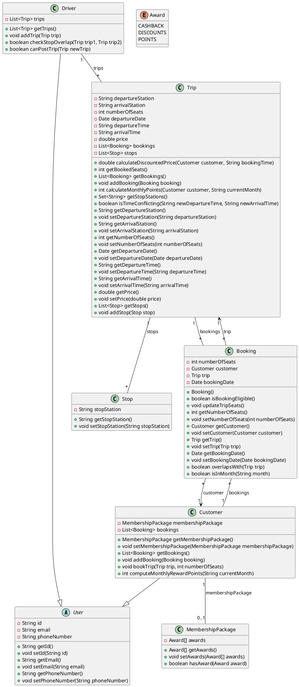

// ==version1==

```plantuml
@startuml
abstract class User {
    - String id
    - String email
    - String phoneNumber
    + String getId()
    + void setId(String id)
    + String getEmail()
    + void setEmail(String email)
    + String getPhoneNumber()
    + void setPhoneNumber(String phoneNumber)
}

class Driver {
    - List<Trip> trips
    + List<Trip> getTrips()
    + void addTrip(Trip trip)
    + boolean checkStopOverlap(Trip trip1, Trip trip2)
    + boolean canPostTrip(Trip newTrip)
}

class Customer {
    - MembershipPackage membershipPackage
    - List<Booking> bookings
    + MembershipPackage getMembershipPackage()
    + void setMembershipPackage(MembershipPackage membershipPackage)
    + List<Booking> getBookings()
    + void addBooking(Booking booking)
    + void bookTrip(Trip trip, int numberOfSeats)
    + int computeMonthlyRewardPoints(String currentMonth)
}

class Trip {
    - String departureStation
    - String arrivalStation
    - int numberOfSeats
    - Date departureDate
    - String departureTime
    - String arrivalTime
    - double price
    - List<Booking> bookings
    - List<Stop> stops
    + double calculateDiscountedPrice(Customer customer, String bookingTime)
    + int getBookedSeats()
    + List<Booking> getBookings()
    + void addBooking(Booking booking)
    + int calculateMonthlyPoints(Customer customer, String currentMonth)
    + Set<String> getStopStations()
    + boolean isTimeConflicting(String newDepartureTime, String newArrivalTime)
    + String getDepartureStation()
    + void setDepartureStation(String departureStation)
    + String getArrivalStation()
    + void setArrivalStation(String arrivalStation)
    + int getNumberOfSeats()
    + void setNumberOfSeats(int numberOfSeats)
    + Date getDepartureDate()
    + void setDepartureDate(Date departureDate)
    + String getDepartureTime()
    + void setDepartureTime(String departureTime)
    + String getArrivalTime()
    + void setArrivalTime(String arrivalTime)
    + double getPrice()
    + void setPrice(double price)
    + List<Stop> getStops()
    + void addStop(Stop stop)
}

class Stop {
    - String stopStation
    + String getStopStation()
    + void setStopStation(String stopStation)
}

class Booking {
    - int numberOfSeats
    - Customer customer
    - Trip trip
    - Date bookingDate
    + Booking()
    + boolean isBookingEligible()
    + void updateTripSeats()
    + int getNumberOfSeats()
    + void setNumberOfSeats(int numberOfSeats)
    + Customer getCustomer()
    + void setCustomer(Customer customer)
    + Trip getTrip()
    + void setTrip(Trip trip)
    + Date getBookingDate()
    + void setBookingDate(Date bookingDate)
    + boolean overlapsWith(Trip trip)
    + boolean isInMonth(String month)
}

class MembershipPackage {
    - Award[] awards
    + Award[] getAwards()
    + void setAwards(Award[] awards)
    + boolean hasAward(Award award)
}

enum Award {
    CASHBACK
    DISCOUNTS
    POINTS
}

Driver --|> User
Customer --|> User
Driver "1" -- "*" Trip : trips
Customer "1" -- "*" Booking : bookings
Customer "1" -- "0..1" MembershipPackage : membershipPackage
Trip "1" -- "*" Booking : bookings
Trip "1" -- "*" Stop : stops
Booking "*" --> "1" Trip : trip
Booking "*" --> "1" Customer : customer
@enduml
```
// ==end==
