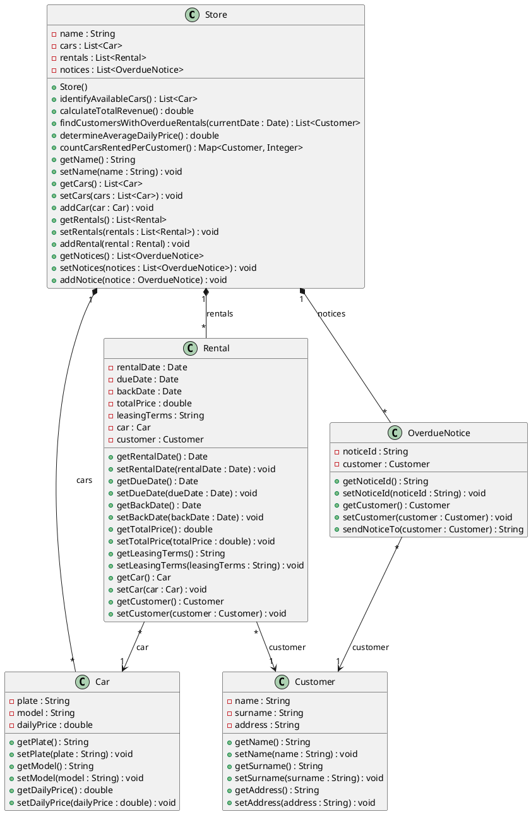

// ==version1==

```plantuml
@startuml
class Store {
  - name : String
  - cars : List<Car>
  - rentals : List<Rental>
  - notices : List<OverdueNotice>
  + Store()
  + identifyAvailableCars() : List<Car>
  + calculateTotalRevenue() : double
  + findCustomersWithOverdueRentals(currentDate : Date) : List<Customer>
  + determineAverageDailyPrice() : double
  + countCarsRentedPerCustomer() : Map<Customer, Integer>
  + getName() : String
  + setName(name : String) : void
  + getCars() : List<Car>
  + setCars(cars : List<Car>) : void
  + addCar(car : Car) : void
  + getRentals() : List<Rental>
  + setRentals(rentals : List<Rental>) : void
  + addRental(rental : Rental) : void
  + getNotices() : List<OverdueNotice>
  + setNotices(notices : List<OverdueNotice>) : void
  + addNotice(notice : OverdueNotice) : void
}

class Car {
  - plate : String
  - model : String
  - dailyPrice : double
  + getPlate() : String
  + setPlate(plate : String) : void
  + getModel() : String
  + setModel(model : String) : void
  + getDailyPrice() : double
  + setDailyPrice(dailyPrice : double) : void
}

class Customer {
  - name : String
  - surname : String
  - address : String
  + getName() : String
  + setName(name : String) : void
  + getSurname() : String
  + setSurname(surname : String) : void
  + getAddress() : String
  + setAddress(address : String) : void
}

class Rental {
  - rentalDate : Date
  - dueDate : Date
  - backDate : Date
  - totalPrice : double
  - leasingTerms : String
  - car : Car
  - customer : Customer
  + getRentalDate() : Date
  + setRentalDate(rentalDate : Date) : void
  + getDueDate() : Date
  + setDueDate(dueDate : Date) : void
  + getBackDate() : Date
  + setBackDate(backDate : Date) : void
  + getTotalPrice() : double
  + setTotalPrice(totalPrice : double) : void
  + getLeasingTerms() : String
  + setLeasingTerms(leasingTerms : String) : void
  + getCar() : Car
  + setCar(car : Car) : void
  + getCustomer() : Customer
  + setCustomer(customer : Customer) : void
}

class OverdueNotice {
  - noticeId : String
  - customer : Customer
  + getNoticeId() : String
  + setNoticeId(noticeId : String) : void
  + getCustomer() : Customer
  + setCustomer(customer : Customer) : void
  + sendNoticeTo(customer : Customer) : String
}

Store "1" *-- "*" Car : cars
Store "1" *-- "*" Rental : rentals
Store "1" *-- "*" OverdueNotice : notices
Rental "*" --> "1" Car : car
Rental "*" --> "1" Customer : customer
OverdueNotice "*" --> "1" Customer : customer
@enduml
```
// ==end==
