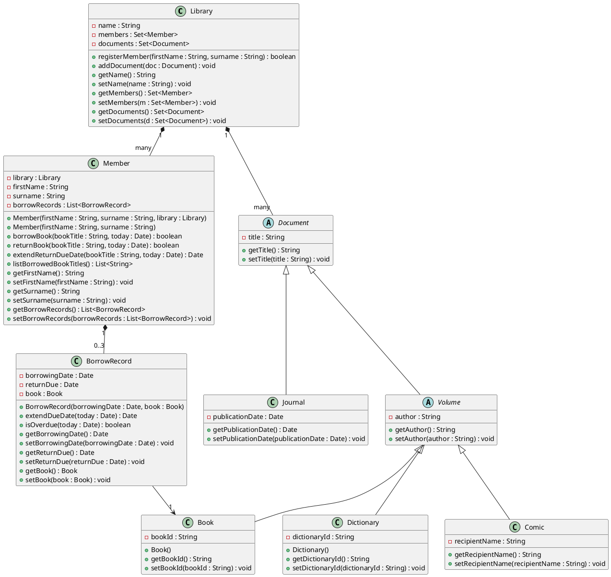

// ==version1==

```plantuml
@startuml
class Library {
  - name : String
  - members : Set<Member>
  - documents : Set<Document>
  + registerMember(firstName : String, surname : String) : boolean
  + addDocument(doc : Document) : void
  + getName() : String
  + setName(name : String) : void
  + getMembers() : Set<Member>
  + setMembers(m : Set<Member>) : void
  + getDocuments() : Set<Document>
  + setDocuments(d : Set<Document>) : void
}

class Member {
  - library : Library
  - firstName : String
  - surname : String
  - borrowRecords : List<BorrowRecord>
  + Member(firstName : String, surname : String, library : Library)
  + Member(firstName : String, surname : String)
  + borrowBook(bookTitle : String, today : Date) : boolean
  + returnBook(bookTitle : String, today : Date) : boolean
  + extendReturnDueDate(bookTitle : String, today : Date) : Date
  + listBorrowedBookTitles() : List<String>
  + getFirstName() : String
  + setFirstName(firstName : String) : void
  + getSurname() : String
  + setSurname(surname : String) : void
  + getBorrowRecords() : List<BorrowRecord>
  + setBorrowRecords(borrowRecords : List<BorrowRecord>) : void
}

class BorrowRecord {
  - borrowingDate : Date
  - returnDue : Date
  - book : Book
  + BorrowRecord(borrowingDate : Date, book : Book)
  + extendDueDate(today : Date) : Date
  + isOverdue(today : Date) : boolean
  + getBorrowingDate() : Date
  + setBorrowingDate(borrowingDate : Date) : void
  + getReturnDue() : Date
  + setReturnDue(returnDue : Date) : void
  + getBook() : Book
  + setBook(book : Book) : void
}

abstract class Document {
  - title : String
  + getTitle() : String
  + setTitle(title : String) : void
}

class Journal {
  - publicationDate : Date
  + getPublicationDate() : Date
  + setPublicationDate(publicationDate : Date) : void
}

abstract class Volume {
  - author : String
  + getAuthor() : String
  + setAuthor(author : String) : void
}

class Book {
  - bookId : String
  + Book()
  + getBookId() : String
  + setBookId(bookId : String) : void
}
class Dictionary {
  - dictionaryId : String
  + Dictionary()
  + getDictionaryId() : String
  + setDictionaryId(dictionaryId : String) : void
}
class Comic {
  - recipientName : String
  + getRecipientName() : String
  + setRecipientName(recipientName : String) : void
}

Library "1" *-- "many" Member
Library "1" *-- "many" Document
Member "1" *-- "0..3" BorrowRecord
BorrowRecord --> "1" Book
Document <|-- Journal
Document <|-- Volume
Volume <|-- Book
Volume <|-- Dictionary
Volume <|-- Comic
@enduml
```
// ==end==
