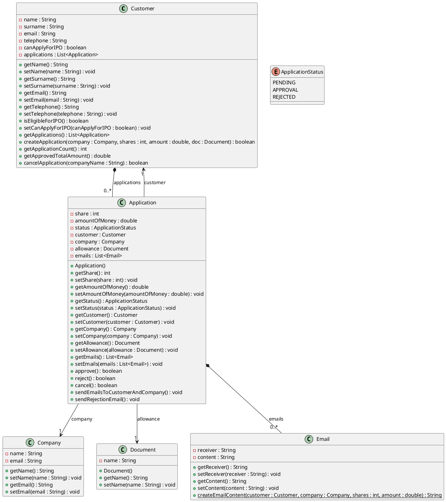

// ==version1==

```plantuml
@startuml
class Customer {
  - name : String
  - surname : String
  - email : String
  - telephone : String
  - canApplyForIPO : boolean
  - applications : List<Application>
  + getName() : String
  + setName(name : String) : void
  + getSurname() : String
  + setSurname(surname : String) : void
  + getEmail() : String
  + setEmail(email : String) : void
  + getTelephone() : String
  + setTelephone(telephone : String) : void
  + isEligibleForIPO() : boolean
  + setCanApplyForIPO(canApplyForIPO : boolean) : void
  + getApplications() : List<Application>
  + createApplication(company : Company, shares : int, amount : double, doc : Document) : boolean
  + getApplicationCount() : int
  + getApprovedTotalAmount() : double
  + cancelApplication(companyName : String) : boolean
}

enum ApplicationStatus {
  PENDING
  APPROVAL
  REJECTED
}

class Application {
  - share : int
  - amountOfMoney : double
  - status : ApplicationStatus
  - customer : Customer
  - company : Company
  - allowance : Document
  - emails : List<Email>
  + Application()
  + getShare() : int
  + setShare(share : int) : void
  + getAmountOfMoney() : double
  + setAmountOfMoney(amountOfMoney : double) : void
  + getStatus() : ApplicationStatus
  + setStatus(status : ApplicationStatus) : void
  + getCustomer() : Customer
  + setCustomer(customer : Customer) : void
  + getCompany() : Company
  + setCompany(company : Company) : void
  + getAllowance() : Document
  + setAllowance(allowance : Document) : void
  + getEmails() : List<Email>
  + setEmails(emails : List<Email>) : void
  + approve() : boolean
  + reject() : boolean
  + cancel() : boolean
  + sendEmailsToCustomerAndCompany() : void
  + sendRejectionEmail() : void
}

class Company {
  - name : String
  - email : String
  + getName() : String
  + setName(name : String) : void
  + getEmail() : String
  + setEmail(email : String) : void
}

class Document {
  - name : String
  + Document()
  + getName() : String
  + setName(name : String) : void
}

class Email {
  - receiver : String
  - content : String
  + getReceiver() : String
  + setReceiver(receiver : String) : void
  + getContent() : String
  + setContent(content : String) : void
  + {static} createEmailContent(customer : Customer, company : Company, shares : int, amount : double) : String
}

Application --> "1" Document : allowance
Application --> "1" Customer : customer
Customer *-- "0..*" Application : applications
Application --> "1" Company : company
Application *-- "0..*" Email : emails
@enduml
```
// ==end==
