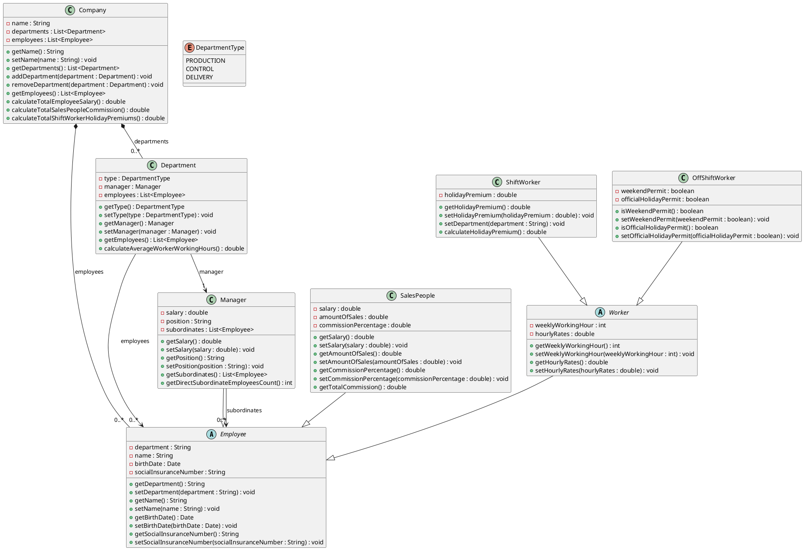

// ==version1==

```plantuml
@startuml
abstract class Employee {
  - department : String
  - name : String
  - birthDate : Date
  - socialInsuranceNumber : String
  + getDepartment() : String
  + setDepartment(department : String) : void
  + getName() : String
  + setName(name : String) : void
  + getBirthDate() : Date
  + setBirthDate(birthDate : Date) : void
  + getSocialInsuranceNumber() : String
  + setSocialInsuranceNumber(socialInsuranceNumber : String) : void
}

class Manager {
  - salary : double
  - position : String
  - subordinates : List<Employee>
  + getSalary() : double
  + setSalary(salary : double) : void
  + getPosition() : String
  + setPosition(position : String) : void
  + getSubordinates() : List<Employee>
  + getDirectSubordinateEmployeesCount() : int
}

class SalesPeople {
  - salary : double
  - amountOfSales : double
  - commissionPercentage : double
  + getSalary() : double
  + setSalary(salary : double) : void
  + getAmountOfSales() : double
  + setAmountOfSales(amountOfSales : double) : void
  + getCommissionPercentage() : double
  + setCommissionPercentage(commissionPercentage : double) : void
  + getTotalCommission() : double
}

abstract class Worker {
  - weeklyWorkingHour : int
  - hourlyRates : double
  + getWeeklyWorkingHour() : int
  + setWeeklyWorkingHour(weeklyWorkingHour : int) : void
  + getHourlyRates() : double
  + setHourlyRates(hourlyRates : double) : void
}

class ShiftWorker {
  - holidayPremium : double
  + getHolidayPremium() : double
  + setHolidayPremium(holidayPremium : double) : void
  + setDepartment(department : String) : void
  + calculateHolidayPremium() : double
}

class OffShiftWorker {
  - weekendPermit : boolean
  - officialHolidayPermit : boolean
  + isWeekendPermit() : boolean
  + setWeekendPermit(weekendPermit : boolean) : void
  + isOfficialHolidayPermit() : boolean
  + setOfficialHolidayPermit(officialHolidayPermit : boolean) : void
}

class Department {
  - type : DepartmentType
  - manager : Manager
  - employees : List<Employee>
  + getType() : DepartmentType
  + setType(type : DepartmentType) : void
  + getManager() : Manager
  + setManager(manager : Manager) : void
  + getEmployees() : List<Employee>
  + calculateAverageWorkerWorkingHours() : double
}

class Company {
  - name : String
  - departments : List<Department>
  - employees : List<Employee>
  + getName() : String
  + setName(name : String) : void
  + getDepartments() : List<Department>
  + addDepartment(department : Department) : void
  + removeDepartment(department : Department) : void
  + getEmployees() : List<Employee>
  + calculateTotalEmployeeSalary() : double
  + calculateTotalSalesPeopleCommission() : double
  + calculateTotalShiftWorkerHolidayPremiums() : double
}

enum DepartmentType {
  PRODUCTION
  CONTROL
  DELIVERY
}

Manager --|> Employee
SalesPeople --|> Employee
Worker --|> Employee
ShiftWorker --|> Worker
OffShiftWorker --|> Worker
Manager --> "0..*" Employee : subordinates
Company *-- "0..*" Department : departments
Company *-- "0..*" Employee : employees
Department --> "1" Manager : manager
Department --> "0..*" Employee : employees
@enduml
```
// ==end==
